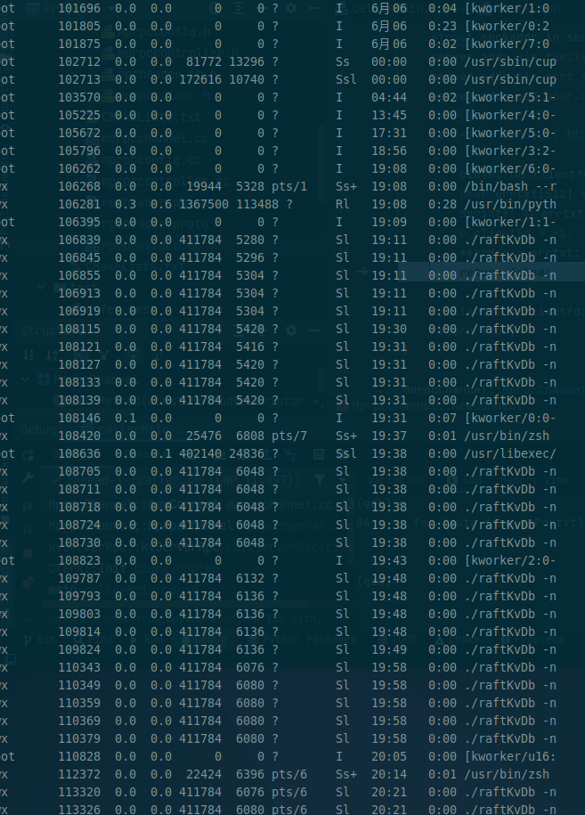
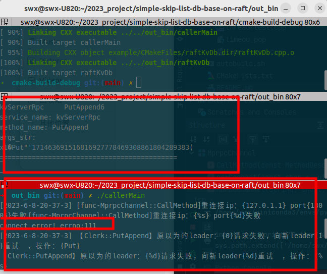

# simple-skip-list-db-base-on-raft

## 项目简介
本项目是一个基于raft分布式协议实现的kv数据库。

## 使用方法
### 使用
### 压力测试


完成任务：将go上的raft迁移到c++实现。
需要的大步骤：
1. rpc的实现
   迁移已经学习过的rpc库：rpc1

2. goruntime的替代
   好像没有办法很好替代，只能手动开多线程来处理。
    但是可以开线程池来实现，这样的话可能存在有的线程一直没执行完导致线程不够用卡死的情况。

3. go的chan的替代
   在本项目中往往只有一个线程来接收消息，不会存在多个线程来一起竞争chan的问题，因此c++中只需要简单的实现多线程通通信即可。
   简单来说就是使用锁（go中也实现了，因此这里不算多用） + 条件变量（替代管道）实现即可。


## todoList
- [ ] rpc的改造 预计今天实现 2023-5-26     实际实现：未完成，先延后，因为需要先完成cmake编译项目的学习。
- [x] raft迁移，预计两天  2023-5-28开始                实际实现： 2023年05月31日
- [x] kvserver迁移，预计半天   2023年06月01日开始  实际完成：2023年06月04日
- [x] 配置整个项目的cmake，cmake需要学习  cmake学习参考：https://www.bilibili.com/video/BV18R4y127UV/?spm_id_from=333.337.search-card.all.click&vd_source=b39a7d56e3c8769f8d478b0c4cac403e 和同门哈哈哈   
 开始日期：2023年06月04日       完成日期：2023年06月07日
- [x] 測試發現出現一些奇怪的問題，全都是運行的指令，後臺沒有正常結束，如下图这种，发现出现的问题太多，需要好好梳理才行，因此单独开一栏

- [ ] goruntime更加优雅的实现，使用线程池
- [ ] 添加跳表，预计两天
- [ ] 使用智能指针和范围锁保证良好的资源管理 https://blog.csdn.net/yu_xiaoxian_2018/article/details/112689345
- [x] 持久化方案，persist类使用boost完成序列化 备选：手动实现|protobuf|boost的序列化库  经过RPC的是使用protobuf实现，没有经过RPC的持久化通过boost库实现
- [ ] 补充README文件，预计半天
- [ ] 编译后所有的头文件都补充到`out_lib`目录


## 出现的问题以及解决方案
### clerk连接raft有时候成功有时候失败
如题，在重新连接的时候，集群是有反应的，但是客户端又会显示连接失败，具体来说应该是有些能成功连接上，有些不能成功连接




## 一些依赖的安装方法
> 只在本机测试过

机器配置：
```bash
> swx@swx-U820:~$  lsb_release -a
No LSB modules are available.
Distributor ID:	Ubuntu
Description:	Ubuntu 22.04.2 LTS
Release:	22.04
Codename:	jammy
```

**boost库**
```
sudo apt-get install libboost-all-dev
```
boost库更多安装方法参考： https://blog.csdn.net/qq_41854911/article/details/119454212